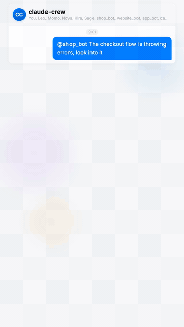
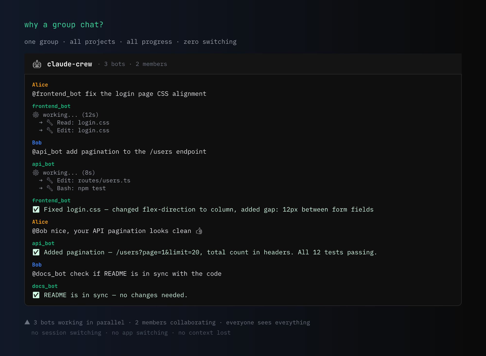
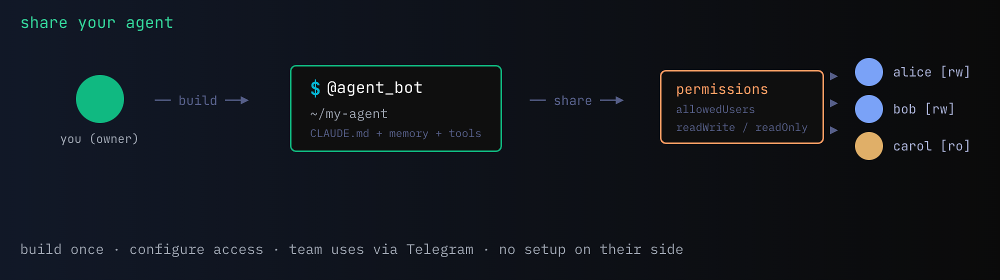
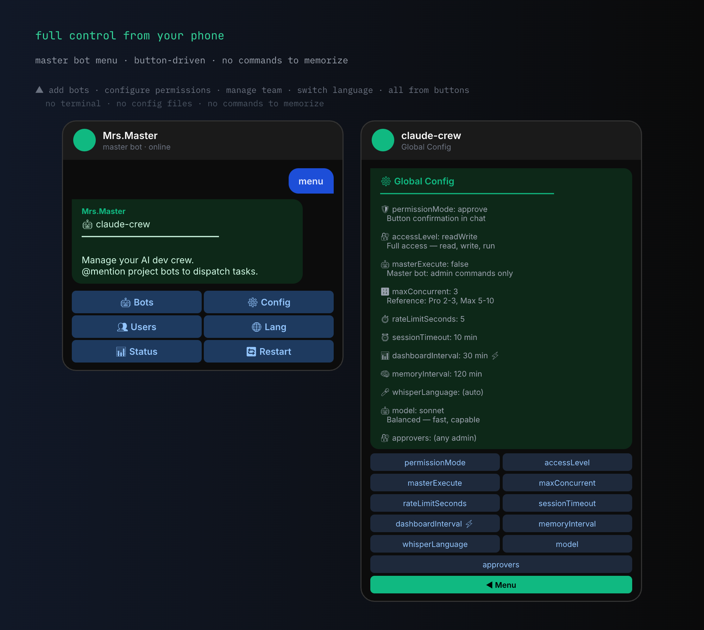

[English](README.md) | [中文](README_CN.md)

<p align="center">
  
</p>

<p align="center">
  <a href="LICENSE"></a>
  
  
  
</p>

**Claude Code — Every Project, Anywhere.**

One bot per project, all in one group chat. No more switching between terminal windows or telling Claude "go look at project X" — just @mention the right bot. Clear boundaries between codebases, structured multi-project workflows, managed from your phone.

- **For individuals** — orchestrate all your projects remotely from a single chat
- **For teams** — shared workspace with per-bot permissions, everyone on the same timeline

Your **master bot** is the control center: add project bots, configure settings, manage access, and monitor everything via button menus. Each **project bot** connects to a codebase and runs Claude Code on @mention.

<p align="center">
  
</p>

### See it in action

<p align="center">
  
</p>

<!-- TODO: Replace with YouTube link after upload
<p align="center">
  <a href="https://youtube.com/watch?v=YOUR_VIDEO_ID">
    
  </a>
</p>
-->

### Why a group chat?

Other solutions require you to switch between sessions, tabs, or apps when working on multiple projects. claude-crew puts everything in **one group chat** — all project bots, all requests, all responses, all progress updates in a single timeline. @mention a bot, it works. @mention another, it works in parallel. You see every project's activity without switching anything. Your team sees it too. One group is your entire development cockpit.



## ✨ Highlights

### Multi-project cluster management

Every project gets a dedicated bot. @mention to dispatch — no terminal tabs, no session switching. Multiple bots run in parallel, each with isolated context. Five projects at once, zero bleed between them. Add a new project from your phone in 30 seconds: paste token → name → path → online.

### Team collaboration in a shared timeline

All requests, progress, results, and team discussions flow through one timeline. When a bot finishes, your whole team sees it instantly — no screenshots, no "check my terminal". Team members chat alongside bot activity, react to results, and follow up in real time. Every bot reply is tagged with `#projectName` so you can filter any project's full history with one tap. Results also @mention the person who made the request, ensuring they get notified.

### Permission system built for teams

| Layer | What it controls | Options |
|-------|-----------------|---------|
| **Access Level** | What the bot CAN do | `readWrite` — full access · `readOnly` — read, search, analyze only |
| **Permission Mode** | How writes are authorized | `approve` (default) — button confirmation in chat · `auto` — Claude's safety classifier · `allowAll` — pre-authorized |
| **User Access** | Who can use each bot | `owner` — full control · `admins` — all bots + configurable menu permissions · `allowedUsers` — per-bot member list · others — rejected |
| **Approvers** | Who must approve writes | `approvers: ["id1", "id2"]` — ALL listed users must approve before writes execute. Empty = any single admin |
All configurable globally or per-bot, from button menus on your phone. Sensitive project? Set `readOnly`. Trusted solo project? Set `allowAll`. Team project? Set `approve` with specific approvers so writes require the right people to confirm.

### Phone-first management

Button menus for everything: add/remove project bots, configure permissions and settings, manage team members, view dashboard. After initial `setup.sh`, you never need to touch a terminal again.

### Always on — built-in daemon

Background daemon with watchdog auto-restart and auto-start on login. No tmux, no screen, no "keep the terminal open". Your bots stay online 24/7. Crash? Watchdog restarts in 3 seconds. Reboot? Auto-start brings everything back.

### Project continuity

Each bot remembers its project's state across sessions: `--continue` resumes the last conversation, and the pinned dashboard shows every project's git branch, last commit, context usage, and cost at a glance. No matter who changed what or when — open the group and you're up to date.

Use `/new` to reset when context gets stale, `/compact` to compress without losing key info (admin), `/model` to switch models (admin), `/effort` to tune thinking depth, `/cost` and `/status` to monitor — all from chat, zero token overhead.

### Solves real pain points

| Common pain points with other solutions | How claude-crew solves it |
|-----------|--------------------------|
| Connection drops after idle | Stateless pull architecture — no idle timeout, ever |
| Permission prompts unreachable remotely | Approve buttons sent directly to group chat |
| No push notifications | Every bot reply pushes to your phone |
| Single repo limitation | One bot per project, unlimited projects |
| Requires active terminal / tmux | Built-in daemon + watchdog + auto-start |
| Context bloats after a day of use | Independent short-process sessions, `/compact` command |
| Restart = lost context | `--continue` resumes conversation, Claude Code auto-memory persists on disk |
| Headless server auth fails | Supports API key — no browser needed |
| Bot rejects when busy | Task queue — shows position, auto-processes when ready |
| API key expires → repeated errors | Circuit breaker pauses after 3 failures, shows root cause |

## Table of Contents

- [Three Ways to Use](#-three-ways-to-use)
- [Master Bot — Your Control Center](#-master-bot--your-control-center)
- [Project Bots — Your Dev Team](#-project-bots--your-dev-team)
- [Recommendations](#-recommendations)
- [Prerequisites](#-prerequisites)
- [Quick Start](#-quick-start)
- [Usage](#-usage)
- [Configuration](#%EF%B8%8F-configuration)
- [Architecture](#-architecture)
- [Troubleshooting](#-troubleshooting)
- [Security & Privacy](#-security--privacy)
- [Changelog](#-changelog)
- [Contributing](#-contributing)

## 🎯 Three Ways to Use

### 1:N Hub Mode

Pull all bots into one group. @mention to switch between projects — no context switching.


### Team Mode

2–10 people in a shared group. Per-bot permissions keep everyone in their lane.


### Share Your Agent

Built a Claude Code agent with custom instructions, CLAUDE.md, and memory? Create a project bot, configure access permissions, and let your team use it directly from Telegram — no setup on their side.



## 🤖 Master Bot — Your Control Center

The master bot is your management backend on Telegram. Send `menu` to open the interactive button menu — everything is button-driven, no commands to memorize.

### Full control from your phone

Add project bots, configure permissions, manage team access — all through inline button menus. Every setting includes a description of what it does, so you can customize the entire system without reading docs. No terminal needed after initial setup.



### Live project dashboard

A pinned message that auto-refreshes with all your projects at a glance — git branch, last commit, context usage, cost, and rate limit countdown. Your team's mission control.


### Scheduled tasks

Set up recurring tasks per bot (daily or every N minutes) — code reviews, health checks, report generation. With `--continue` session resumption, every task picks up where the last one left off.

## ⚡ Project Bots — Your Dev Team

Each project bot is assigned to a codebase. @mention it in the group (or DM it directly) to run Claude Code tasks.

### Instant feedback

Your message gets a 👀 reaction the moment a bot picks it up — you always know your request was received.


### Real-time progress

See exactly what Claude is doing as it works — file reads, edits, commands, all streamed live to your chat.


### Flexible permissions

Three permission modes, configurable per bot or globally:

- **approve** (default) — first run read-only; if writes needed, sends a button for admin approval
- **auto** — Claude Code's background safety classifier auto-approves safe ops, blocks dangerous ones
- **allowAll** — all tools pre-authorized, no prompts, fastest execution


### Photo analysis

Send a photo with a caption @mentioning a bot for visual analysis. Claude reads the image before responding.

### Quote anything

Reply to any message — text, photo, file, or sticker — while @mentioning a bot. The quoted content is automatically included in the prompt.

## 📋 Recommendations

### Who is this for?

| Scenario | Fit | Suggested config |
|----------|-----|-----------------|
| Solo developer, 2–5 projects | Best fit | `permissionMode: "allowAll"`, single admin |
| Small team (2–3 people) | Good fit | `permissionMode: "approve"`, per-bot `allowedUsers` |
| Shared machine, mixed trust | Use with caution | `accessLevel: "readOnly"` for untrusted users, `"approve"` for trusted |
| Enterprise / multi-tenant | Not designed for this | Consider Docker-isolated solutions instead |

### Configuration tips

- **`approve` mode is the default** — switch to `allowAll` once you're comfortable with the system
- **Set `readOnly` on sensitive projects** to let team members browse code without write risk
- **Use `allowedUsers` per bot** rather than adding everyone to `admins` — admins can use all bots
- **Lower `maxConcurrent`** if you're on a rate-limited Claude plan (default 3 may be too many)

### Cost awareness

Each task runs as an independent session. Claude recovers context by reading your code and git history — but there are a few cost implications to be aware of:

- **`approve` mode costs more** — each task that needs write access runs Claude twice (read-only first, then retry with approved tools). Use `allowAll` or `auto` if you trust the environment.
- **Quoting images is expensive** — a single screenshot can use 50K+ tokens. Prefer text descriptions when possible.
- **Memory files grow over time** — Claude Code auto-memory files are loaded into every session. Periodically clean up `~/.claude/projects/*/memory/` if costs increase.
- **Cron tasks are full sessions** — each scheduled task is a complete Claude invocation. Use longer intervals for non-urgent tasks.

> **Tip:** The dashboard shows cost per invocation and cumulative session cost. Monitor it to understand your usage patterns.

### What this project does NOT do

- **No Docker isolation** — all bots run in the same process with access to the local filesystem. The built-in permission system (accessLevel + permissionMode + allowedUsers) provides sufficient control for personal and small-team use, but is not a security boundary for untrusted users.
- **Requires Claude Code CLI** — this project is a management layer, not a standalone bot. You need a working `claude` CLI on the machine, authenticated via subscription (Pro/Max), API key (`ANTHROPIC_API_KEY`), or cloud provider (Bedrock/Vertex).
- **No cloud deployment** — designed to run on a local machine or personal server where your code lives.

## 📦 Prerequisites

> **This project is NOT a standalone AI bot.** It is a management layer on top of Claude Code CLI. You need a computer (Mac/Linux/server) running 24/7 with Claude Code CLI installed and authenticated. Your Telegram messages are routed to this machine, which runs `claude -p` locally and sends results back. The setup script will verify dependencies automatically.

### Required

| Dependency | Why | Install |
|-----------|-----|---------|
| **[Claude Code CLI](https://claude.ai/claude-code)** | Core runtime — all AI tasks run through `claude -p` | `npm install -g @anthropic-ai/claude-code` |
| **Authenticated CLI** | Subscription (Pro/Max), API key, or cloud provider | Run `claude` to login, or set `ANTHROPIC_API_KEY` |
| **[Bun](https://bun.sh)** >= 1.0 | Daemon runtime | `curl -fsSL https://bun.sh/install \| bash` |

### Verify before proceeding

```bash
claude --version    # should print version (not "command not found")
bun --version       # should print >= 1.0
```

## 🚀 Quick Start

**Terminal (one-time setup):**

```bash
git clone https://github.com/qiudeqiu/claude-crew.git && cd claude-crew
bash scripts/setup.sh    # asks for your Telegram User ID + master bot token, then starts daemon
```

> Create a master bot via [@BotFather](https://t.me/BotFather) first (`/newbot`). You only need one token to get started.

**Telegram (everything else):**

1. Create a private group, add your master bot
2. Disable Group Privacy: @BotFather → `/mybots` → select bot → **Bot Settings** → **Group Privacy** → **Turn off**
3. The bot auto-detects the group and shows a welcome guide
4. Use `@master menu` to manage everything — add project bots, configure settings, manage users

<details>
<summary><b>Detailed Setup Guide (step by step)</b></summary>

## Setup Guide

### Step 1: Clone

```bash
git clone https://github.com/qiudeqiu/claude-crew.git
cd claude-crew
```

### Step 2: Create a Master Bot

Open [@BotFather](https://t.me/BotFather), send `/newbot`, and save the token.

> Project bots are added later from Telegram via `@master bots` — you don't need to create them now.

### Step 3: Run Setup

```bash
bash scripts/setup.sh
```

This will:
- Check dependencies (bun, claude)
- Ask for your master bot token (validates via Telegram API)
- Auto-detect your Telegram User ID (just send a message to the bot)
- Create `bot-pool.json` config file at `~/.claude/channels/telegram/`
- Optionally enable auto-start on login
- Start the daemon

> `setup.sh` only sets up the master bot. Project bots are added afterwards via `@master bots` in Telegram or `manage-pool.sh add` in the terminal.

### Step 4: Telegram Setup

1. Create a **private group** in Telegram
2. Add your master bot to the group
3. **Critical** — disable Group Privacy in @BotFather:

   `/mybots` → select bot → **Bot Settings** → **Group Privacy** → **Turn off**

   > Bots cannot see group messages with Group Privacy enabled!

4. The bot auto-detects the group and shows a welcome guide with options:
   - Add project bots (one per project)
   - Open the management menu

5. Use `@master menu` for all ongoing management — add bots, configure settings, manage users

That's it. Everything else is managed from Telegram.

<details>
<summary><b>Terminal alternatives (optional)</b></summary>

If you prefer terminal over the interactive wizard:

```bash
# Set group ID
bash scripts/manage-pool.sh init-group

# Add project bots
bash scripts/manage-pool.sh add <project_token>

# Assign projects
bash scripts/manage-pool.sh assign <bot_username> <project_name> <path>

# Restart to apply
bash scripts/daemon.sh restart
```

</details>

</details>

## 📱 Usage

### Interacting with Bots

| Action | How | Example |
|--------|-----|---------|
| Run a task | `@bot request` | `@frontend_bot fix the login bug` |
| Continue conversation | Reply to bot's message | Reply with follow-up |
| Quote + ask | Reply to any message + `@bot` | Select message → Reply → `@bot explain this` |
| Photo analysis | Photo + `@bot caption` | Photo + `@api_bot what's this error?` |

### Master Bot Commands

All master commands are accessible via **button menu** or text. Send `menu` to the master bot to open.

| Command | Description |
|---------|-------------|
| `@master menu` | Open interactive button menu |
| `@master setup` | First-time setup wizard |
| `@master bots` | Manage project bots (add/remove/configure) |
| `@master config` | Edit global settings via buttons |
| `@master users` | Manage admins & per-bot users |
| `@master status` | Force-refresh project dashboard |
| `@master search <keyword>` | Grep across all projects |
| `@master restart` | Restart daemon (reloads config) |
| `@master cron list` | List scheduled tasks |
| `@master cron add @bot HH:MM task` | Daily task at HH:MM |
| `@master cron add @bot */N task` | Every N minutes |
| `@master cron del <id>` | Delete task |

> The menu supports English and Chinese. Switch language via the `Lang` button in the menu.

### Daemon Management

```bash
daemon.sh start          # Start daemon (background)
daemon.sh stop           # Stop daemon
daemon.sh restart        # Restart
daemon.sh status         # Status + bot pool overview
daemon.sh logs           # Last 50 log lines
daemon.sh logs 200       # Last 200 lines
daemon.sh autostart      # Enable auto-start on login
daemon.sh no-autostart   # Disable auto-start
```

> **How it works:** As long as the daemon is running, all Telegram bots are online and responsive — no other processes needed. If your computer restarts or the daemon stops, bots go offline until the daemon is started again.
>
> **If bots go offline after a reboot**, run this in terminal to bring them back:
> ```bash
> ~/.claude/channels/telegram/daemon.sh start
> ```
> To avoid this, enable auto-start so the daemon launches automatically on login:
> ```bash
> ~/.claude/channels/telegram/daemon.sh autostart
> ```
> No sudo required — runs under your user account. The setup script will ask you about this during installation. Disable with `daemon.sh no-autostart`.

## ⚙️ Configuration

### Access & Permission (Two-Layer Control)

Permissions are configured in two layers. Set globally or per-bot — via `@master config` button menu or directly in `bot-pool.json`:

**Layer 1: Access Level** (`accessLevel`) — what the bot CAN do:

| Level | Behavior | Best for |
|-------|----------|----------|
| `readWrite` (default) | Read and write files, run commands | Admins, trusted collaborators |
| `readOnly` | Read, search, analyze only. No file edits, no write commands. | Reviewers, new members, auditing |

**Layer 2: Permission Mode** (`permissionMode`) — how writes are authorized (only when `readWrite`):

| Mode | Behavior | Best for |
|------|----------|----------|
| `approve` (default) | First run read-only. If writes needed, Telegram button asks for approval. Retry with approved tools. | New users, multi-user teams, sensitive projects |
| `auto` | All actions auto-approved with Claude Code's background safety classifier. Blocks dangerous ops (production deploys, force push, data deletion).  | Balance of speed and safety |
| `allowAll` | Bash, Edit, Write, Agent, Skill pre-authorized. No prompts. | Trusted single-user setup |

**Permission Matrix** — what each combination allows:

| `accessLevel` | `permissionMode` | Read/Search | Bash (read) | Edit/Write | Bash (write) | Approval |
|---------------|------------------|:-----------:|:-----------:|:----------:|:------------:|:--------:|
| `readWrite` | `allowAll` | ✅ | ✅ | ✅ | ✅ | Auto |
| `readWrite` | `auto` | ✅ | ✅ | ✅ | ✅ | Background classifier |
| `readWrite` | `approve` | ✅ | ✅ | ✅ | ✅ | Button confirm |
| `readOnly` | (ignored) | ✅ | ✅ | ❌ | ❌ | N/A |

Combined with access control:

| User role | Bot has `allowedUsers` | Can use bot | Effective access |
|-----------|----------------------|:-----------:|-----------------|
| **Owner / Admin** | Any | ✅ | Bot's `accessLevel` + `permissionMode` |
| **Member** (in `allowedUsers`) | Lists this user | ✅ | Bot's `accessLevel` + `permissionMode` |
| **Member** (not in list) | Doesn't list user | ❌ | No access |
| **Others** | Any | ❌ | Rejected with permission hint |

### bot-pool.json

All configuration lives in a single file — `~/.claude/channels/telegram/bot-pool.json`.

The setup wizard and `manage-pool.sh add` generate a complete config with all defaults visible — both global settings and per-bot fields. Example:

```json
{
  "activePlatform": "telegram",
  "telegram": {
    "owner": "123456789",
    "admins": [{"id": "987654321", "permissions": ["bots", "config", "users", "restart", "cron"]}],
    "sharedGroupId": "-100123456789",
    "bots": [
      {
        "token": "123:AAH...",
        "username": "master_bot",
        "role": "master"
      },
      {
        "token": "456:AAH...",
        "username": "proj_bot",
        "role": "project",
        "assignedProject": "my-app",
        "assignedPath": "/home/user/my-app",
        "accessLevel": "readWrite",
        "permissionMode": "approve",
        "allowedUsers": ["111111111", "222222222"]
      }
    ]
  },
  "accessLevel": "readWrite",
  "permissionMode": "approve",
  "masterExecute": false,
  "maxConcurrent": 3,
  "rateLimitSeconds": 5,
  "sessionTimeoutMinutes": 10,
  "dashboardIntervalMinutes": 30,
  "language": "en",
  "model": "sonnet",
  "sessionMode": "continue"
}
```

> Platform-specific fields (`admins`, `sharedGroupId`, `bots`) live inside the platform section. Shared settings live at the top level. Switch platforms by changing `activePlatform`. Old flat-format configs are auto-migrated on first startup.

#### Platform Section

| Field | Description |
|-------|-------------|
| `owner` | **(required)** Original admin ID. Cannot be removed. Has all permissions. |
| `admins` | Secondary admins with granular permissions. Each entry: `{"id": "...", "permissions": [...]}`. |
| `sharedGroupId` | Group/channel ID where all bots operate. |
| `bots` | Array of bot configs (see Per-Bot Settings below). |

#### Global Settings

All configurable via `@master config` button menu or directly in `bot-pool.json`.

| Field | Default | Description |
|-------|---------|-------------|
| `accessLevel` | `"readWrite"` | `"readWrite"` = full access. `"readOnly"` = read/search only, no writes. |
| `permissionMode` | `"approve"` | How writes are authorized. `"approve"` = button confirmation. `"auto"` = Claude's safety classifier. `"allowAll"` = pre-authorize all tools. |
| `language` | `"en"` | Menu and message language. `"en"` or `"zh"`. Switchable via menu button. |
| `model` | (Claude default) | Claude model for all bots. `"sonnet"` (balanced), `"opus"` (strongest), `"haiku"` (fastest/cheapest). |
| `sessionMode` | `"continue"` | `"continue"` = resume last conversation. `"fresh"` = clean context each time (lower cost per task). |
| `maxConcurrent` | `3` | Maximum parallel Claude invocations across all bots. |
| `rateLimitSeconds` | `5` | Minimum gap between invocations for the same bot. Prevents flooding. |
| `sessionTimeoutMinutes` | `10` | Maximum duration per Claude invocation. Auto-killed if exceeded. |
| `dashboardIntervalMinutes` | `30` | Dashboard auto-refresh interval (requires restart to change). |
| `masterExecute` | `false` | Allow master bot to also run Claude tasks (not just admin commands). |

#### Per-Bot Settings

Each project bot can override global settings. Configurable via `@master bots` → select bot → edit.

| Field | Default | Description |
|-------|---------|-------------|
| `assignedProject` | — | Display name for the project (e.g. `"my-api"`, `"frontend"`). |
| `assignedPath` | — | Absolute path to the project directory on disk. |
| `accessLevel` | (inherit global) | Override access level. `"readOnly"` for view-only access. |
| `permissionMode` | (inherit global) | Override permission mode for this bot. |
| `model` | (inherit global) | Override model. Use different models per project complexity. |
| `allowedUsers` | `[]` | User IDs who can use this bot. Owner and admins always have access. |
| `approvers` | `[]` | User IDs who must ALL approve writes. Empty = any single admin can approve. |

#### Access Control

| Role | Bot Access | Menu Access | Can Approve |
|------|-----------|-------------|-------------|
| **Owner** | All bots | Full menu + manage admins | Yes |
| **Admin** | All bots | Per-permission (`bots`, `config`, `users`, `restart`, `cron`) | Yes |
| **Member** (per-bot `allowedUsers`) | Only listed bots | None | No |
| **Others** | Rejected | None | No |

> **Owner** is set during initial setup and cannot be removed. Admins are added by the Owner with configurable menu permissions (editable anytime via `@master users`).

> Most configuration changes take effect immediately (permissions, rate limits, timeouts, etc.). **Exceptions that require restart:** `dashboardIntervalMinutes` and adding/removing bots. The interactive setup (`@master bots`, `@master config`) offers a one-click restart button when needed.

### manage-pool.sh Commands

```bash
manage-pool.sh add <token> [--master]        # Add bot
manage-pool.sh list                          # List all bots
manage-pool.sh assign <user> <name> <path>   # Assign project to bot
manage-pool.sh release [project]             # Release assignment
manage-pool.sh remove <username>             # Remove bot
manage-pool.sh set-group <id>                # Set group ID
manage-pool.sh init-group                    # Auto-detect group ID
manage-pool.sh set-mode <allowAll|approve>   # Set permission mode
```

## 🏗 Architecture


### Process Supervision

The daemon runs under a **watchdog** that auto-restarts on crash:
- Crashes are retried after 3 seconds
- If 5 crashes happen within 5 minutes (rapid crash loop), the watchdog gives up
- `daemon.sh stop` removes the PID file first, signaling the watchdog to exit cleanly

### Self-Modification Safety

When a project bot modifies the daemon's own code (e.g., the `telegram-pool` project bot editing `daemon.ts`):
1. Claude is instructed to finish all edits and send a reply first
2. Optionally writes a `restart-note.json` with a summary
3. Runs `daemon.sh restart` as the very last command
4. Watchdog restarts the daemon, master bot notifies the group with the summary

## 🔧 Troubleshooting

| Problem | Cause | Fix |
|---------|-------|-----|
| Bot not responding in group | Group Privacy enabled | @BotFather → Bot Settings → Group Privacy → **Turn off** |
| `409 Conflict` in logs | Another process polling same bot | `pkill -f "claude.*channels"` then `daemon.sh restart` |
| Bot replies `(no output)` | Empty prompt or stdin timeout | Ensure message has content beyond @mention |
| Progress stuck, no response | Claude session hung or timed out | `daemon.sh logs` to diagnose, then `daemon.sh restart` |
| Daemon keeps crashing | Rapid crash loop | Watchdog gives up after 5 rapid crashes. Check logs, fix issue, restart |
| Bot restarted itself | Project bot edited daemon code | Expected — watchdog auto-restarts, master bot notifies group |
| Dashboard shows no data | No invocations since daemon start | Stats are in-memory, reset on restart. Make a call first |

## 🔒 Security & Privacy

### Data stays local

All data is stored locally on your machine — **nothing is sent to third-party servers**:

| Data | Location | Shared with |
|------|----------|-------------|
| Bot tokens, config | `~/.claude/channels/telegram/bot-pool.json` | Nobody |
| Logs, session state | `~/.claude/channels/telegram/` | Nobody |
| Project source code | Your local directories | Nobody |

The only external communication is:
- **Telegram Bot API** — sending/receiving messages (your bots, your group)
- **Claude API** — running Claude Code tasks (via your subscription, API key, or cloud provider)

No analytics, no telemetry, no cloud sync, no remote database.

### Verify it yourself

This project runs as a background daemon with access to your filesystem. You should verify it before trusting it:

- **Read the source** — ~7200 lines of TypeScript, no minification, no obfuscation. Small enough to audit in an afternoon.
- **Runs from source** — `bun run src/daemon.ts` executes the TypeScript directly. No compiled binaries, no build artifacts. What you read is what runs.
- **Minimal dependencies** — [grammY](https://grammy.dev) (Telegram) and [discord.js](https://discord.js.org) (Discord). No hidden packages. Check `package.json`.
- **No external network calls** — only communicates with Telegram Bot API and your local `claude` CLI. Verify: `grep -r "fetch" src/` shows only Telegram file downloads.
- **No data collection** — no analytics, no telemetry, no remote database. Verify: `grep -r "analytics\|telemetry\|track" src/`
- **Monitor at runtime** — check all network connections: `lsof -i -p $(cat ~/.claude/channels/telegram/daemon.pid)`

### Access control

- **Role-based access**: admins can use all bots; members only access bots that list them in `allowedUsers`; others rejected with permission hint
- **Two-layer permissions**: `accessLevel` (readWrite/readOnly) + `permissionMode` (approve/auto/allowAll) — configurable globally and per-bot
- **Env isolation**: Claude subprocesses receive filtered environment variables — bot tokens and sensitive keys are excluded
- **Token protection**: `bot-pool.json` stored with mode 0600, excluded from git via `.gitignore`

### Runtime protection

- **Rate limiting**: configurable concurrent limit and per-bot cooldown
- **Timeout**: configurable session timeout per invocation
- **Process supervision**: watchdog auto-restarts on crash, gives up after 5 rapid crashes
- **Self-restart safety**: when a project bot modifies daemon code, it finishes work and replies before restarting

## 🌐 Platform Roadmap

claude-crew currently supports **Telegram**. The architecture uses a platform abstraction layer (`Platform` interface) designed for horizontal multi-platform support.

| Platform | Status | Notes |
|----------|--------|-------|
| **Telegram** | Supported | Full feature parity, production-tested |
| **Discord** | Experimental | Adapter shipped, core features working |
| **Feishu (Lark)** | Planned | Architecture ready, adapter not started |

> The Platform interface (`src/platform/types.ts`) defines all capabilities — messaging, buttons, files, threads. Adding a new platform means implementing this interface. Core logic (task execution, permissions, queue, dashboard) is platform-agnostic.

## 📋 Changelog

### v0.4.0 — Platform abstraction & resilience (current)

- **Three-tier permission system**: Owner (immutable, full control) → Admin (configurable menu permissions: bots/config/users/restart/cron) → User (per-bot access). Owner manages admins via button menu with per-permission toggles. Old flat `admins` array auto-migrated.
- **Platform-segmented config**: `bot-pool.json` restructured — platform-specific fields (`owner`, `admins`, `bots`, `sharedGroupId`) nested under `telegram`/`discord` sections, shared settings at top level. Old flat format auto-migrated on startup.
- **Session mode**: new `sessionMode` setting — `"continue"` (default, resumes last conversation) or `"fresh"` (clean context each time). Configurable via button menu.
- **Runtime resilience**: circuit breaker (3 failures → pause, 5min auto-recovery), adaptive rate limiting (uses real API reset times), output truncation recovery, error classification with per-type recovery.
- **Guide system**: interactive guide with sub-pages — Quick Start, Tips, Master Bot, Project Bot, Cron — with navigation buttons.
- **Cron improvements**: delete buttons in task list, project name support in `cron add` (resolves to bot username automatically), syntax guide shown alongside task list.
- **Post-add guidance**: after adding a project bot, Telegram users see clear next steps (add to group, disable Group Privacy, restart).
- **Discord adapter** (experimental): Platform interface implementation, role mention detection, i18n Discord-aware text. Marked as planned in docs.
- **Removed**: voice/whisper feature (heavy dependency, not core), periodic memory saves (redundant with Claude Code built-in memory).
- **Security hardening**: `getSafeEnv` switched to deny-by-default for unknown env vars, `setBotValue` path validation, queue dispatch race fix, `/compact` busy guard.

### v0.3.0 — Core experience enhancement

- **Slash commands**: `/new` (reset session), `/compact` (compress context), `/model` (switch model), `/effort` (thinking depth), `/cost` (spend stats), `/memory` (view CLAUDE.md), `/status` (bot state) — all handled at daemon level, most cost zero tokens
- **Task queue**: busy bot queues tasks instead of rejecting — shows queue position and processes automatically when ready
- **Approvers list**: configure specific people who must ALL approve — button shows "Allow (1/2)", resolves when everyone approves
- **Context warning**: warns at 80% context usage with `/compact` hint

### v0.2.0 — Multi-project cluster management

- **@mention routing**: one bot per project, @mention to switch, all in one group chat
- **Button menus**: add bots, configure settings, manage users — entirely from your phone
- **Two-layer permissions**: accessLevel (readWrite/readOnly) + permissionMode (approve/auto/allowAll), configurable per bot
- **Real-time progress**: see what Claude is doing as it works — file reads, edits, commands
- **Pinned dashboard**: git branch, last commit, context usage, cost — all projects at a glance
- **Cron scheduler**: daily or interval-based recurring tasks
- **Project memory**: `--continue` resumes last conversation, context persists across sessions
- **Background daemon**: watchdog auto-restart, auto-start on login — no tmux needed
- **#project hashtags**: click to filter any project's full timeline
- **Bilingual UI**: English and Chinese
- **Default approve mode**: safer onboarding for new users
- **Flexible auth**: subscription, API key, or cloud provider (Bedrock/Vertex)

## 🤝 Contributing

PRs welcome! Please open an issue first to discuss what you'd like to change.

1. Fork the repo
2. Create a feature branch (`git checkout -b feat/my-feature`)
3. Commit your changes
4. Push and open a PR

For bugs, please include daemon logs (`daemon.sh logs 100`) and your `bot-pool.json` (redact tokens).

## 🙏 Acknowledgements

Dashboard design inspired by [claude-hud](https://github.com/jarrodwatts/claude-hud) — context window tracking and session metrics concepts.

## 📄 License

Apache 2.0
