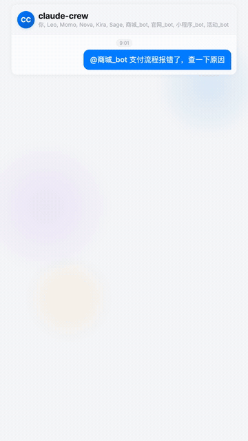

[English](README.md) | [中文](README_CN.md)

<p align="center">
  
</p>

<p align="center">
  <a href="LICENSE"></a>
  
  
  
  
  
  
</p>

**Claude Code — Every Project, Anywhere.**

一个项目一个 bot，全部汇聚在一个聊天里。不用在多个终端窗口间来回切换，也不用每次都跟 Claude 说"帮我看看某某项目"—— @提及对应的 bot 就行。项目之间边界清晰，多项目工作结构化且有条不紊，在手机上即可管理。支持 **Telegram**、**飞书**、**微信**、**Discord** 四大平台。

- **个人** — 在一个群里远程调度你所有的项目
- **团队** — 共享工作空间，per-bot 权限控制，所有人同一条时间线

**主控机器人**是你的控制中心：添加项目机器人、修改配置、管理权限、监控状态，全部通过按钮菜单完成。每个**项目机器人**对接一个代码仓库，@提及即可执行 Claude Code 任务。

<p align="center">
  
</p>

### 看看效果

<p align="center">
  
</p>

<!-- TODO: 上传到 Bilibili 后替换
<p align="center">
  <a href="https://bilibili.com/video/YOUR_VIDEO_ID">
    
  </a>
</p>
-->

### 为什么是群聊？

其他方案在多项目之间工作时，你需要切换 session、切换 tab、切换 app。claude-crew 把一切放进**一个 IM 群** — 所有项目 bot、所有请求、所有回复、所有进度，汇聚在同一条时间线上。@一个 bot，它干活；@另一个，它并行干活。所有项目的动态一目了然，不用切换任何东西。你的团队也同样看得到。一个群就是你的整个开发驾驶舱。


## 🌐 平台支持

| 平台 | 路由方式 | 交互 UI | 文件发送 | 状态 |
|------|---------|---------|---------|------|
| **Telegram** | @mention 独立 bot | 内联键盘按钮 | 图片/文件 | 生产可用 |
| **飞书/Lark** | @mention 独立 bot | 卡片交互 + 延迟更新 API | 图片上传 | 已测试 |
| **微信** | #标签 虚拟项目 | 数字菜单（自动转换） | AES 加密 CDN 上传 | 已测试 |
| **Discord** | @mention 独立 bot | 按钮组件 | 附件 | 已实现 |

每个平台都有独立的适配器，实现统一的 `Platform` 接口——所有核心功能（Claude 执行、权限、队列、进度追踪）在各平台上行为一致。平台差异（按钮 vs 数字菜单、@mention vs #标签）在适配器层透明处理。

## ✨ 亮点

### 多项目集群管理

每个项目一个专属 bot。@mention 调度 — 不用切终端、不用切 session。多个 bot 并行运行，各自上下文隔离。五个项目同时跑，零互相污染。手机上 30 秒加一个新项目：粘贴 token → 填名字 → 填路径 → 上线。

### 团队在统一时间线上协作

所有请求、进度、结果、团队讨论汇聚在同一条时间线。Bot 完成任务的瞬间，整个团队都看到 — 不用截图、不用"你看下我的终端"。成员在 bot 动态之间直接沟通，实时跟进结果。每条 bot 回复自动带 `#项目名` 标签，点击即可筛选该项目的完整历史。结果还会 @发起请求的人，确保 TA 收到通知。

### 为团队设计的权限体系

| 层级 | 控制什么 | 选项 |
|------|---------|------|
| **访问级别** | bot 能做什么 | `readWrite` — 完整访问 · `readOnly` — 只能读、搜、分析 |
| **权限模式** | 写操作如何授权 | `approve`（默认）— 群里按钮确认 · `auto` — Claude 安全分类器 · `allowAll` — 预授权 |
| **用户权限** | 谁能用哪个 bot | `owner` — 全部控制 · `admins` — 所有 bot + 可配置菜单权限 · `allowedUsers` — 按 bot 分配 · 其他人 — 拒绝 |
| **审批人** | 谁必须同意 | `approvers: ["id1", "id2"]` — 所有列出的人都同意才能执行。空 = 任意管理员 |
全局或 per-bot 配置，全在手机按钮菜单里完成。敏感项目设 `readOnly`，个人项目设 `allowAll`，团队项目设 `approve` + 指定审批人 — 写操作需要指定的人全部同意。

### 手机即管理后台

按钮菜单搞定一切：加减项目 bot、配置权限和参数、管理团队成员、查看仪表盘。`setup.sh` 之后，你再也不用碰终端。

### 始终在线 — 内置 daemon

后台 daemon + watchdog 崩溃重启 + 开机自启。不需要 tmux，不需要 screen，不需要"保持终端打开"。你的 bot 全天候在线。崩溃？3 秒重启。重启机器？自动恢复。

### 项目连续性

每个 bot 始终了解项目最新状态：`--continue` 接续上次对话，置顶仪表盘展示每个项目的 git 分支、最新 commit、context 用量、花费。不管谁在什么时候改了什么 — 打开群就知道。

用 `/new` 重置过时上下文，`/compact` 压缩但不丢关键信息（管理员），`/model` 切换模型（管理员），`/effort` 调整思考深度，`/cost` 和 `/status` 监控 — 全在群里操作，零 token 开销。

### 解决真实痛点

| 其他方案的常见痛点 | claude-crew 如何解决 |
|------|---------------------|
| 空闲断连 | 无状态拉取架构 — 永不超时断连 |
| 权限审批远程不可达 | approve 按钮直接发到群聊 |
| 缺少推送通知 | 每条 bot 回复自动推送到手机 |
| 单仓库限制 | 一个 bot 一个项目，无限项目 |
| 需要保持终端 / tmux | 内置 daemon + watchdog + 开机自启 |
| 长时间使用上下文膨胀变慢 | 独立短进程 session，`/compact` 命令压缩 |
| 重启后失忆 | 对话文件 + memory 文件持久化在磁盘 |
| 无头服务器认证失败 | 支持 API key — 不需要浏览器 |
| bot 忙时直接拒绝 | 任务队列 — 显示位置，就绪后自动处理 |
| API key 过期→反复报错 | 熔断器 3 次失败后暂停，提示根因 |

## 目录

- [三种使用模式](#-三种使用模式)
- [主控机器人 — 你的控制中心](#-主控机器人--你的控制中心)
- [项目机器人 — 你的开发团队](#-项目机器人--你的开发团队)
- [使用建议](#-使用建议)
- [前置条件](#-前置条件)
- [快速开始](#-快速开始)
- [使用方法](#-使用方法)
- [配置](#%EF%B8%8F-配置)
- [架构](#-架构)
- [常见问题](#-常见问题)
- [安全与隐私](#-安全与隐私)
- [更新日志](#-更新日志)
- [参与贡献](#-参与贡献)

## 🎯 三种使用模式

### 1:N 集中模式

把所有 bot 拉进一个群，@mention 切换项目 —— 不用来回跳转。


### 团队协作模式

2–10 人共用一个群，per-bot 权限控制谁能操作什么项目 —— 协作不冲突。


### 分享你的 Agent

用 Claude Code 构建了自定义 Agent（CLAUDE.md + 记忆 + 指令）？创建一个 project bot，配置访问权限，团队成员直接在 Telegram 里使用 —— 他们无需任何安装。


## 🤖 主控机器人 — 你的控制中心

主控机器人是你在 Telegram 上的管理后台。发送 `menu` 打开交互式按钮菜单 —— 所有操作按钮驱动，不需要记命令。

### 手机全掌控

添加项目机器人、配置权限、管理团队成员 —— 全部通过按钮菜单完成。每个配置项都附带说明，无需查文档即可自定义整个系统。初始安装后不再需要终端。


### 实时项目看板

自动刷新的置顶消息，一览所有项目 —— git 分支、最近提交、context 用量、费用和限速倒计时。团队的任务控制中心。


### 定时任务

为每个 bot 设定定时任务（每天定时或每 N 分钟）—— 代码审查、健康检查、报告生成。配合 `--continue` 会话恢复，每个任务都能接续上一个的进度。

## ⚡ 项目机器人 — 你的开发团队

每个项目机器人分配到一个代码仓库。在群里 @提及（或直接私聊）即可执行 Claude Code 任务。

### 即时反馈

发送消息后 bot 立即回应 👀 —— 你随时知道请求已被接收。


### 实时进度

Claude 工作时实时显示正在做什么 —— 读文件、编辑、执行命令，全部流式推送到聊天中。


### 灵活权限

三种权限模式，可按 bot 或全局配置：

- **allowAll** — 所有工具预授权，无提示，最快执行
- **auto** — Claude Code 后台安全分类器自动批准安全操作，阻止危险操作
- **approve** — 首次只读运行；需要写操作时，Telegram 弹出按钮请求管理员批准


### 图片分析

发送截图 + @项目bot 描述，Claude 会先读图再回答。

### 引用任意内容

回复任意消息 —— 文字、图片、文件或贴纸 —— 同时 @提及机器人，引用内容自动包含在 prompt 中。

## 📋 使用建议

### 适合谁？

| 场景 | 适合度 | 建议配置 |
|------|--------|---------|
| 个人开发者，2–5 个项目 | 最佳 | `permissionMode: "allowAll"`，单管理员 |
| 小团队（2–3 人） | 适合 | `permissionMode: "approve"`，per-bot `allowedUsers` |
| 共享机器，信任度不一 | 谨慎使用 | 不信任的用户设 `accessLevel: "readOnly"`，信任的设 `"approve"` |
| 企业 / 多租户 | 不适用 | 建议使用 Docker 隔离方案 |

### 配置建议

- **默认即为 `approve` 模式** —— 熟悉系统后可切换到 `allowAll` 以提升效率
- **敏感项目设 `readOnly`** —— 团队成员可以查看代码但没有写入风险
- **用 per-bot `allowedUsers`** 而不是把所有人加到 `admins` —— admin 可以操作所有 bot
- **限流计划下调低 `maxConcurrent`** —— 默认 3 可能太多

### 成本须知

每个任务以独立会话运行。Claude 通过读取代码、git 历史和记忆文件恢复上下文 — 以下是一些成本相关的注意事项：

- **`approve` 模式更贵** — 每个需要写操作的任务会调用 Claude 两次（先只读，再授权重试）。如果信任环境，建议用 `allowAll` 或 `auto`。
- **引用图片很贵** — 一张截图可能消耗 50K+ tokens。尽量用文字描述代替。
- **记忆文件会增长** — Claude Code auto-memory 文件每次会话都会加载。如果成本上升，定期清理 `~/.claude/projects/*/memory/`。
- **定时任务是完整会话** — 每个计划任务都是一次完整的 Claude 调用。非紧急任务建议用较长间隔。

> **提示：** 看板会显示每次调用的成本和累计费用，用来了解你的使用情况。

### 本项目不做什么

- **无 Docker 隔离** —— 所有 bot 运行在同一进程中，可访问本地文件系统。内置权限系统（accessLevel + permissionMode + allowedUsers）足以满足个人和小团队使用，但不构成对不信任用户的安全边界。
- **依赖 Claude Code CLI** —— 本项目是管理层，不是独立 bot。需要机器上有可用的 `claude` CLI，支持订阅（Pro/Max）、API key（`ANTHROPIC_API_KEY`）或云厂商（Bedrock/Vertex）认证。
- **无云部署** —— 设计为运行在代码所在的本地机器或个人服务器上。

## 📦 前置条件

> **本项目不是独立的 AI 机器人。** 它是 Claude Code CLI 之上的管理层。你需要一台 24/7 运行的电脑（Mac/Linux/服务器），上面安装并认证了 Claude Code CLI。你的 Telegram 消息会路由到这台机器，在本地执行 `claude -p` 后将结果返回。安装脚本会自动检查依赖。

### 必需

| 依赖 | 用途 | 安装方式 |
|------|------|---------|
| **[Claude Code CLI](https://claude.ai/claude-code)** | 核心运行时 —— 所有 AI 任务通过 `claude -p` 执行 | `npm install -g @anthropic-ai/claude-code` |
| **已认证 CLI** | 订阅（Pro/Max）、API key 或云厂商均可 | 运行 `claude` 登录，或设置 `ANTHROPIC_API_KEY` |
| **[Bun](https://bun.sh)** >= 1.0 | Daemon 运行时 | `curl -fsSL https://bun.sh/install \| bash` |

### 安装前验证

```bash
claude --version    # 应输出版本号（不是 "command not found"）
bun --version       # 应输出 >= 1.0
```

## 🚀 快速开始

**终端（一次性安装）：**

```bash
git clone https://github.com/qiudeqiu/claude-crew.git && cd claude-crew
bash scripts/setup.sh    # 引导式安装 — 选择平台、输入凭证、启动 daemon
```

<details>
<summary><b>各平台 bot 创建方式</b></summary>

| 平台 | 创建方式 | Token 格式 |
|------|---------|-----------|
| **Telegram** | [@BotFather](https://t.me/BotFather) → `/newbot` | `123456789:ABCdefGHI...` |
| **飞书** | [开放平台](https://open.feishu.cn/app) → 创建应用 → 添加 Bot → 开通权限（`im:message`, `im:message.group_at_msg:readonly`）→ 事件: `im.message.receive_v1`（长连接）→ 回调: `card.action.trigger`（长连接）→ 发布版本 | `cli_a5xxxxx:app_secret` |
| **微信** | 扫码连接 iLink Bot（daemon 启动时自动引导） | 扫码自动获取 |
| **Discord** | [Developer Portal](https://discord.com/developers/applications) → New Application → Bot → Reset Token → 开启 MESSAGE CONTENT INTENT | `MTQ4ODU1.GRPIaY.cv3...` |

</details>

**安装后：**

| 平台 | 后续步骤 |
|------|---------|
| **Telegram** | 创建私密群组 → 拉入 bot → 在 @BotFather 关闭 Group Privacy → `@master menu` |
| **飞书** | 将 bot 添加到群聊 → `@bot menu` |
| **微信** | 直接给 bot 发 `menu`（私聊）→ 用 `#项目名` 发送任务 |
| **Discord** | 邀请 bot 到服务器 → 在频道中 `@bot menu` |

<details>
<summary><b>详细安装步骤</b></summary>

## 安装指南

### 第一步：克隆

```bash
git clone https://github.com/qiudeqiu/claude-crew.git
cd claude-crew
```

### 第二步：创建主控机器人

打开 [@BotFather](https://t.me/BotFather)，发送 `/newbot`，保存 token。

> 项目机器人之后在 Telegram 中通过 `@master bots` 添加，现在不需要创建。

### 第三步：运行安装脚本

```bash
bash scripts/setup.sh
```

脚本会：
- 检查依赖（bun、claude）
- 要求输入主控机器人 token（通过 Telegram API 验证）
- 自动获取你的 Telegram User ID（给 bot 发条消息即可）
- 创建 `bot-pool.json` 配置文件至 `~/.claude/channels/telegram/`
- 可选开启开机自启
- 启动 daemon

> `setup.sh` 只设置主控机器人。项目机器人之后通过 `@master bots` 在 Telegram 中添加，或用 `manage-pool.sh add` 在终端添加。

### 第四步：Telegram 设置

1. 在 Telegram 创建一个**私密群组**
2. 把主控机器人拉进群
3. **关键步骤** —— 在 @BotFather 中关闭 Group Privacy：

   `/mybots` → 选择机器人 → **Bot Settings** → **Group Privacy** → **Turn off**

   > 不关闭 Group Privacy，机器人无法看到群消息！

4. 机器人自动检测群组，显示欢迎引导：
   - 添加项目 bot（每个项目一个）
   - 打开管理菜单

5. 用 `@master menu` 管理一切 —— 添加 bot、配置、用户

搞定。后续一切在 Telegram 中操作。

<details>
<summary><b>终端替代方案（可选）</b></summary>

如果你更习惯终端操作：

```bash
# 设置群组 ID
bash scripts/manage-pool.sh init-group

# 添加项目机器人
bash scripts/manage-pool.sh add <项目token>

# 分配项目
bash scripts/manage-pool.sh assign <机器人用户名> <项目名> <项目路径>

# 重启生效
bash scripts/daemon.sh restart
```

</details>

</details>

## 📱 使用方法

### 与机器人交互

**Telegram / 飞书 / Discord** — 一个项目一个 bot，@提及执行任务：

| 操作 | 方式 | 示例 |
|------|------|------|
| 执行任务 | `@bot 需求` | `@frontend_bot 修复登录bug` |
| 继续对话 | 回复机器人消息 | 回复并追问 |
| 引用 + 提问 | 回复任意消息 + `@bot` | 选中消息 → 回复 → `@bot 解释一下` |
| 图片分析 | 图片 + `@bot 说明` | 截图 + `@api_bot 这个报错怎么回事？` |

**微信** — 一个 bot，`#标签` 路由到虚拟项目：

| 操作 | 方式 | 示例 |
|------|------|------|
| 执行任务 | `#项目名 需求` | `#api 修复登录bug` |
| 继续对话 | 直接发送（路由到上次项目） | `帮我加上测试` |
| 切换项目 | 用另一个 `#标签` | `#web 更新首页` |
| 管理操作 | 发送关键词 | `menu`、`bots`、`config` |

### 引用消息

回复一条消息的同时 @机器人时，引用内容会自动包含：

- **文字** —— 全文传给 Claude
- **图片** —— 下载后由 Claude 分析
- **文件** —— 附带文件名和类型信息

### 主控机器人命令

所有主控命令都可通过**按钮菜单**或文字操作。发送 `menu` 给主控即可打开。

| 命令 | 说明 |
|------|------|
| `@主控 menu` | 打开交互式按钮菜单 |
| `@主控 setup` | 首次设置向导 |
| `@主控 bots` | 管理项目机器人（添加/删除/配置） |
| `@主控 config` | 通过按钮编辑全局设置 |
| `@主控 users` | 管理管理员和用户权限 |
| `@主控 status` | 强制刷新项目看板 |
| `@主控 search <关键词>` | 跨项目搜索代码 |
| `@主控 restart` | 重启 daemon（重新加载配置） |
| `@主控 cron list` | 查看定时任务 |
| `@主控 cron add @bot HH:MM 任务` | 每天定时执行 |
| `@主控 cron add @bot */N 任务` | 每 N 分钟执行 |
| `@主控 cron del <id>` | 删除定时任务 |

> 菜单支持中英文切换，通过菜单中的「语言」按钮切换。

### Daemon 管理

```bash
daemon.sh start          # 启动（后台运行）
daemon.sh stop           # 停止
daemon.sh restart        # 重启
daemon.sh status         # 状态 + 机器人池概览
daemon.sh logs           # 最近 50 行日志
daemon.sh logs 200       # 最近 200 行
daemon.sh autostart      # 启用开机自启
daemon.sh no-autostart   # 禁用开机自启
```

> **工作原理：** 只要 daemon 在运行，所有 Telegram bot 就在线可用，不需要其他进程。如果电脑重启或 daemon 停止，bot 会离线，直到重新启动 daemon。
>
> **重启后 bot 离线了？** 在终端运行：
> ```bash
> ~/.claude/channels/telegram/daemon.sh start
> ```
> 想避免每次手动启动？启用开机自启，daemon 会在登录时自动启动：
> ```bash
> ~/.claude/channels/telegram/daemon.sh autostart
> ```
> 无需 sudo — 以你的用户账户运行。安装脚本会在安装末尾询问是否启用。用 `daemon.sh no-autostart` 禁用。

## ⚙️ 配置

### 访问与权限（两层控制）

权限分两层配置，可在全局或单 bot 级别设置 —— 通过 `@master config` 按钮菜单或直接编辑 `bot-pool.json`：

**第一层：访问级别**（`accessLevel`）— bot 能做什么：

| 级别 | 行为 | 适用场景 |
|------|------|----------|
| `readWrite`（默认） | 可读写文件、执行命令 | 管理员、可信协作者 |
| `readOnly` | 仅可读取、搜索、分析。禁止编辑文件和写入命令 | 审查人员、新成员、审计 |

**第二层：权限模式**（`permissionMode`）— 写操作如何授权（仅 `readWrite` 时生效）：

| 模式 | 行为 | 适用场景 |
|------|------|----------|
| `approve`（默认） | 先以只读运行。如需写操作，Telegram 弹出按钮确认后重试 | 新用户、多人团队、敏感项目 |
| `auto` | 所有操作自动批准，由 Claude Code 后台安全分类器把关。拦截危险操作（生产部署、force push、删除数据等）。 | 速度与安全兼顾 |
| `allowAll` | Bash、Edit、Write、Agent、Skill 预授权，无确认提示 | 个人可信环境 |

**权限配置矩阵** — 各组合下的实际能力：

| `accessLevel` | `permissionMode` | 读取/搜索 | Bash（只读） | 编辑/写入 | Bash（写入） | 授权方式 |
|---------------|------------------|:---------:|:-----------:|:---------:|:----------:|:-------:|
| `readWrite` | `allowAll` | ✅ | ✅ | ✅ | ✅ | 自动 |
| `readWrite` | `auto` | ✅ | ✅ | ✅ | ✅ | 后台分类器 |
| `readWrite` | `approve` | ✅ | ✅ | ✅ | ✅ | 按钮确认 |
| `readOnly` | （忽略） | ✅ | ✅ | ❌ | ❌ | 不适用 |

结合访问控制：

| 用户角色 | Bot 配置了 `allowedUsers` | 能否使用 | 实际权限 |
|---------|--------------------------|:-------:|---------|
| **Owner / Admin** | 任意 | ✅ | 该 bot 的 `accessLevel` + `permissionMode` |
| **成员**（在 `allowedUsers` 中） | 包含此用户 | ✅ | 该 bot 的 `accessLevel` + `permissionMode` |
| **成员**（不在列表中） | 未包含此用户 | ❌ | 无权限 |
| **其他人** | 任意 | ❌ | 拒绝并提示 |

### bot-pool.json

所有配置集中在一个文件 — `~/.claude/channels/telegram/bot-pool.json`。

安装向导和 `manage-pool.sh add` 生成完整配置，全局设置和单 bot 字段的默认值均可见。示例：

```json
{
  "activePlatform": "telegram",
  "telegram": {
    "owner": "123456789",
    "admins": [{"id": "987654321", "permissions": ["bots", "config", "users", "restart", "cron"]}],
    "sharedGroupId": "-100123456789",
    "bots": [
      {
        "token": "123:AAH...",
        "username": "master_bot",
        "role": "master"
      },
      {
        "token": "456:AAH...",
        "username": "proj_bot",
        "role": "project",
        "assignedProject": "my-app",
        "assignedPath": "/home/user/my-app",
        "accessLevel": "readWrite",
        "permissionMode": "approve",
        "allowedUsers": ["111111111", "222222222"]
      }
    ]
  },
  "accessLevel": "readWrite",
  "permissionMode": "approve",
  "masterExecute": false,
  "maxConcurrent": 3,
  "rateLimitSeconds": 5,
  "sessionTimeoutMinutes": 10,
  "dashboardIntervalMinutes": 30,
  "language": "en",
  "model": "sonnet",
  "sessionMode": "continue"
}
```

> 平台相关字段（`admins`、`sharedGroupId`、`bots`）放在平台段内，共享设置放顶层。切换平台只需改 `activePlatform`。旧的平坦格式会在首次启动时自动迁移。

#### 平台段配置

| 字段 | 说明 |
|------|------|
| `owner` | **（必填）** 原始管理员 ID，不可移除，拥有全部权限。 |
| `admins` | 二级管理员，带细粒度菜单权限。格式：`[{"id": "...", "permissions": [...]}]` |
| `sharedGroupId` | 所有 bot 运行的群组/频道 ID。 |
| `bots` | Bot 配置数组（详见下方单 Bot 配置）。 |

#### 全局配置

所有选项均可通过 `@master config` 按钮菜单或直接编辑 `bot-pool.json` 配置。

| 字段 | 默认值 | 说明 |
|------|--------|------|
| `accessLevel` | `"readWrite"` | `"readWrite"` = 读写。`"readOnly"` = 仅读取搜索，禁止写入。 |
| `permissionMode` | `"approve"` | 写操作授权方式。`"approve"` = 按钮确认。`"auto"` = Claude 安全分类器。`"allowAll"` = 预授权所有工具。 |
| `language` | `"en"` | 菜单和消息语言。`"en"` 或 `"zh"`。可通过菜单按钮切换。 |
| `model` | （Claude 默认） | 全局 Claude 模型。`"sonnet"`（均衡）、`"opus"`（最强）、`"haiku"`（最快最便宜）。 |
| `sessionMode` | `"continue"` | `"continue"` = 接续上次对话。`"fresh"` = 每次独立上下文（单次成本更低）。 |
| `maxConcurrent` | `3` | 所有 bot 的最大并发 Claude 调用数。 |
| `rateLimitSeconds` | `5` | 同一 bot 两次调用最小间隔（秒），防止刷屏。 |
| `sessionTimeoutMinutes` | `10` | 单次 Claude 调用最大时长（分钟），超时自动终止。 |
| `dashboardIntervalMinutes` | `30` | 置顶看板自动刷新间隔（分钟），修改需重启。 |
| `masterExecute` | `false` | 允许 master bot 也执行 Claude 任务（不仅限管理命令）。 |

#### 单 Bot 配置

每个 project bot 可覆盖全局设置。通过 `@master bots` → 选择 bot → 编辑。

| 字段 | 默认值 | 说明 |
|------|--------|------|
| `assignedProject` | — | 项目显示名称（如 `"my-api"`、`"frontend"`）。 |
| `assignedPath` | — | 项目目录在磁盘上的绝对路径。 |
| `accessLevel` | （继承全局） | 覆盖访问级别。`"readOnly"` 为仅查看。 |
| `permissionMode` | （继承全局） | 覆盖该 bot 的权限模式。 |
| `model` | （继承全局） | 覆盖模型。可按项目复杂度选择不同模型。 |
| `allowedUsers` | `[]` | 可使用该 bot 的用户 ID 列表。Owner 和管理员始终有权限。 |
| `approvers` | `[]` | 必须全部同意才能执行写操作的审批人。空 = 任意管理员可审批。 |

#### 访问控制

| 角色 | Bot 访问 | 菜单权限 | 可审批 |
|------|---------|---------|-------|
| **Owner**（原始管理员） | 所有 bot | 全部菜单 + 管理其他管理员 | 是 |
| **Admin**（二级管理员） | 所有 bot | 按配置（`bots`、`config`、`users`、`restart`、`cron`） | 是 |
| **成员**（bot 级 `allowedUsers`） | 仅配置了的 bot | 无 | 否 |
| **其他人** | 拒绝 | 无 | 否 |

> **Owner** 在初始 setup 时设定，不可删除。二级管理员由 Owner 添加，菜单权限可随时通过 `@master users` 编辑。

> 大部分配置修改后立即生效（权限、限流、超时等）。**需要重启的例外：**`dashboardIntervalMinutes` 和增删机器人。交互式菜单（`@master bots`、`@master config`）在需要时提供一键重启按钮。

### manage-pool.sh 命令

```bash
manage-pool.sh add <token> [--master]      # 添加机器人
manage-pool.sh list                         # 列出所有机器人
manage-pool.sh assign <用户名> <名称> <路径>  # 分配项目
manage-pool.sh release [项目名]              # 释放分配
manage-pool.sh remove <用户名>               # 移除机器人
manage-pool.sh set-group <ID>               # 设置群组 ID
manage-pool.sh init-group                   # 自动检测群组
manage-pool.sh set-mode <allowAll|approve>  # 设置权限模式
```

## 🏗 架构


### 进程守护

daemon 在 **watchdog** 下运行，崩溃自动重启：
- 崩溃后 3 秒重试
- 5 分钟内连续崩溃 5 次则放弃
- `daemon.sh stop` 先删除 PID 文件，watchdog 检测到后正常退出

### 自修改安全

当项目 bot 修改了 daemon 自身的代码（例如 telegram-pool 项目的 bot 编辑 `daemon.ts`）：
1. Claude 先完成所有编辑并回复结果
2. 可选写入 `restart-note.json` 记录修改摘要
3. 最后执行 `daemon.sh restart`
4. watchdog 重启 daemon，master bot 在群里通知摘要

## 🔧 常见问题

| 问题 | 原因 | 解决 |
|------|------|------|
| 机器人在群里不响应 | Group Privacy 未关闭 | @BotFather → Bot Settings → Group Privacy → **Turn off** |
| 日志出现 `409 Conflict` | 有其他进程在轮询同一个机器人 | `pkill -f "claude.*channels"` 然后 `daemon.sh restart` |
| 机器人回复 `(无输出)` | 消息内容为空或 stdin 超时 | 确保消息除了 @提及外还有实际内容 |
| 进度卡住没反应 | Claude 会话超时或崩溃 | `daemon.sh logs` 查看日志，然后 `daemon.sh restart` |
| Daemon 持续崩溃 | 快速崩溃循环 | watchdog 连续 5 次崩溃后放弃。检查日志，修复后重启 |
| 机器人自己重启了 | 项目机器人修改了 daemon 代码 | 正常现象 —— watchdog 自动重启，群里会收到通知 |
| 看板无数据 | daemon 启动后未调用 | 统计在内存中，重启后重置。先发一次任务 |

## 🔒 安全与隐私

### 数据完全本地化

所有数据存储在你的本地机器上 — **不会发送到任何第三方服务器**：

| 数据 | 位置 | 共享给 |
|------|------|--------|
| Bot token、配置 | `~/.claude/channels/telegram/bot-pool.json` | 无 |
| 日志、会话状态 | `~/.claude/channels/telegram/` | 无 |
| 项目源代码 | 你的本地目录 | 无 |

唯一的外部通信：
- **Telegram Bot API** — 收发消息（你的 bot、你的群组）
- **Claude API** — 执行任务（通过你的订阅、API key 或云厂商）

无数据分析、无遥测、无云端同步、无远程数据库。

### 自行验证

本项目作为后台 daemon 运行，可以访问你的文件系统。在信任它之前，你应该自行验证：

- **阅读源码** — 约 7200 行 TypeScript，无混淆无压缩。一个下午就能审完。
- **从源码直接运行** — `bun run src/daemon.ts` 直接执行 TypeScript，没有编译产物。你看到什么就跑什么。
- **极简依赖** — [grammY](https://grammy.dev)（Telegram）和 [discord.js](https://discord.js.org)（Discord），无隐藏包。查看 `package.json`。
- **无外部网络请求** — 只和 Telegram Bot API 以及本地 `claude` CLI 通信。验证：`grep -r "fetch" src/` 只会看到 Telegram 文件下载。
- **无数据收集** — 无 analytics，无 telemetry，无远程数据库。验证：`grep -r "analytics\|telemetry\|track" src/`
- **运行时监控** — 查看所有网络连接：`lsof -i -p $(cat ~/.claude/channels/telegram/daemon.pid)`

### 访问控制

- **角色访问控制**：管理员可用所有 bot；成员仅可用配置了其 ID 的 bot；其他人拒绝并提示
- **两层权限**：`accessLevel`（读写/只读）+ `permissionMode`（approve/auto/allowAll）— 可全局和单 bot 配置
- **环境隔离**：Claude 子进程接收过滤后的环境变量 — bot token 和敏感密钥被排除
- **Token 保护**：`bot-pool.json` 权限 0600，`.gitignore` 排除

### 运行时保护

- **并发限制**：可配置并发数和 bot 冷却时间
- **超时保护**：可配置单次调用超时
- **进程守护**：watchdog 崩溃自动重启，连续崩溃 5 次后放弃
- **自重启安全**：项目 bot 修改 daemon 代码时，先完成并回复，最后才重启

## 🌐 平台支持计划

claude-crew 目前支持 **Telegram**。架构使用平台抽象层（`Platform` 接口），设计上支持横向扩展多个 IM 平台。

| 平台 | 状态 | 说明 |
|------|------|------|
| **Telegram** | 已支持 | 完整功能，生产验证 |
| **Discord** | 计划中 | 适配器开发中 |
| **飞书 (Lark)** | 计划中 | 架构就绪，适配器未开始 |

> Platform 接口（`src/platform/types.ts`）定义了所有能力 — 消息、按钮、文件、线程。新增平台只需实现该接口。核心逻辑（任务执行、权限、队列、看板）与平台无关。

## 📋 更新日志

### v0.4.0 — 平台抽象与运行时容错（当前版本）

- **三级权限体系**：Owner（不可删除，全部权限）→ Admin（可配置菜单权限：机器人/配置/用户/重启/定时任务）→ User（per-bot 访问）。Owner 通过按钮菜单管理 Admin，支持逐项权限开关。旧 `admins` 数组自动迁移。
- **平台分段配置**：`bot-pool.json` 重构 — 平台相关字段（`owner`、`admins`、`bots`、`sharedGroupId`）嵌套在 `telegram`/`discord` 段内，共享设置在顶层。旧格式启动时自动迁移。
- **会话模式**：新增 `sessionMode` — `"continue"`（默认，接续上次对话）或 `"fresh"`（每次独立上下文）。菜单可配置。
- **运行时容错**：熔断器（3 次失败暂停，5 分钟自动恢复）、自适应限速（使用真实 API 重置时间）、输出截断自动续写、错误分类与分级恢复。
- **指南系统**：交互式分页指南 — 快速上手、使用技巧、主控指南、项目 Bot 指南、定时任务指南，带导航按钮。
- **定时任务增强**：列表中的删除按钮、`cron add` 支持项目名（自动解析为 bot 用户名）、任务列表附带语法说明。
- **添加 Bot 引导**：Telegram 添加 project bot 后显示下一步操作（添加到群、关闭 Group Privacy、重启）。
- **Discord 适配器**（实验性）：Platform 接口实现，role mention 检测，i18n Discord 适配文案。文档标记为计划中。
- **移除**：语音/Whisper 功能（依赖过重，非核心）、定时记忆保存（与 Claude Code 内建记忆冗余）。
- **安全加固**：`getSafeEnv` 改为默认拒绝未知环境变量、`setBotValue` 路径校验、队列调度竞态修复、`/compact` 忙碌锁。

### v0.3.0 — 核心体验强化

- **斜杠命令**：`/new`（重置会话）、`/compact`（压缩上下文）、`/model`（切模型）、`/effort`（思考深度）、`/cost`（花费统计）、`/memory`（查看 CLAUDE.md）、`/status`（bot 状态）— daemon 层处理，大部分零 token
- **任务队列**：bot 忙时排队而非拒绝 — 显示队列位置，就绪后自动处理
- **审批人列表**：指定哪些人必须全部同意 — 按钮显示"允许 (1/2)"，所有人同意才执行
- **上下文预警**：context 用量 80% 预警，提示使用 `/compact` 压缩

### v0.2.0 — 多项目集群管理

- **@mention 路由**：每个项目一个 bot，群内 @mention 切换，零摩擦
- **按钮菜单**：加 bot、改配置、管用户 — 全在手机上完成
- **两层权限**：accessLevel（读写/只读）+ permissionMode（approve/auto/allowAll），per-bot 可配
- **实时进度**：Claude 在读什么文件、改什么代码、跑什么命令，实时可见
- **置顶仪表盘**：git 分支、最新 commit、context 用量、花费 — 所有项目一目了然
- **定时任务**：每日定时或间隔触发的 cron 调度
- **项目记忆**：`--continue` 接续上次对话，上下文跨 session 持久化
- **后台 daemon**：watchdog 崩溃重启、开机自启 — 不需要 tmux
- **#项目标签**：点击即可筛选该项目的完整时间线
- **双语 UI**：中文 / 英文
- **默认 approve 模式**：新用户更安全的默认配置
- **灵活认证**：支持订阅、API key、云厂商（Bedrock/Vertex）

## 🤝 参与贡献

欢迎 PR！请先开 issue 讨论你想做的改动。

1. Fork 本仓库
2. 创建功能分支 (`git checkout -b feat/my-feature`)
3. 提交修改
4. Push 并发起 PR

报告 bug 时请附上 daemon 日志 (`daemon.sh logs 100`) 和 `bot-pool.json`（隐去 token）。

## 🙏 致谢

看板设计参考了 [claude-hud](https://github.com/jarrodwatts/claude-hud) —— context window 追踪和会话指标的理念。

## 📄 开源协议

Apache 2.0
