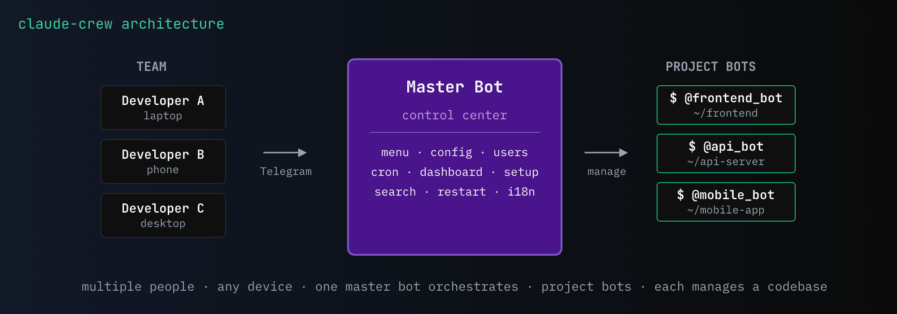
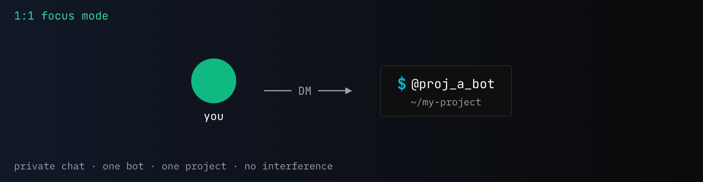
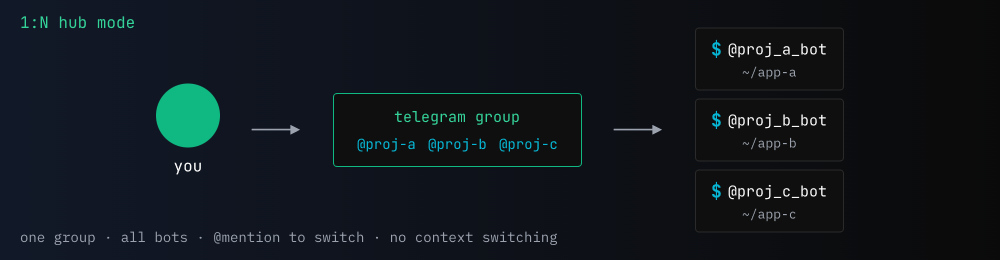
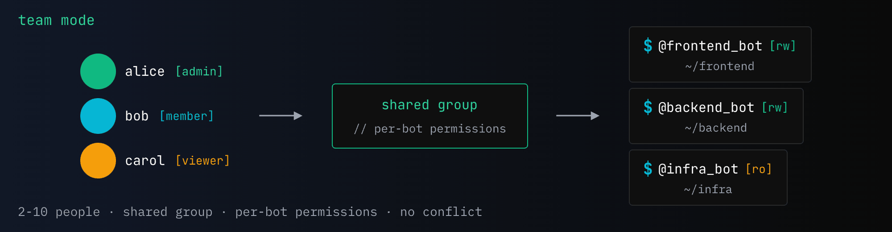
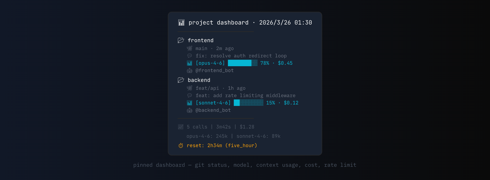
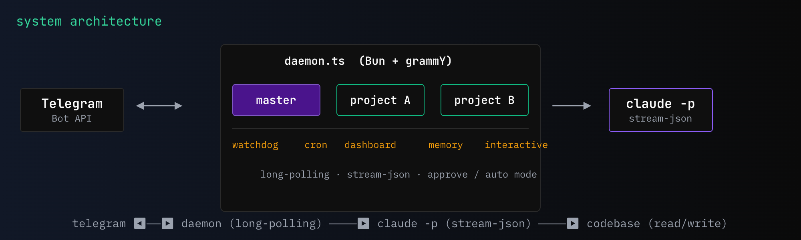

[English](README.md) | [中文](README_CN.md)

<p align="center">
  
</p>

<p align="center">
  <a href="LICENSE"></a>
  
  
  
</p>

**Claude Code — Every Project, Anywhere.**

一个 bot，组建你的 Claude Code 项目管理团队。

远程连接 Claude Code 的跨终端多项目并行管理方案 — 用清晰的架构优雅地管理你的所有项目。**主控机器人**是你的控制中心：添加项目机器人、修改配置、管理团队权限、监控状态，全部通过手机上的按钮菜单完成。每个**项目机器人**对接一个代码仓库，@提及即可执行 Claude Code 任务。一人群控，或邀请团队 — 同一个群，所有项目，各司其职。

<p align="center">
  
</p>

## 📊 远程方案对比

每个方案都有最适合的场景，选适合你的：

| 能力 | **claude-crew** | Claude Code Remote | Claude Code Telegram 插件 | Happy Coder |
|-----|:-:|:-:|:-:|:-:|
| 多项目（上下文隔离） | ✅ 每个项目一个 bot | ✅ 每个项目一个进程 | ❌ 单 session | ✅ 每个项目一个 session |
| 项目切换 | ✅ 群内 @mention | 在 app 里切 session | 不适用（单 bot） | 在 app 里切 session |
| 手机上加新项目 | ✅ 按钮向导 | ❌ 需回终端 | ❌ 需回终端 | ✅ app 内填路径 |
| 团队协作 | ✅ 共享群聊，per-bot 权限 | ❌ 仅单人 | ❌ 仅单人 | ✅ 设备授权 |
| 进程管理 | ✅ 内置 daemon + watchdog + 开机自启 | 手动（tmux / systemd） | 手动（tmux / systemd） | ✅ 内置 daemon |
| 统一仪表盘 | ✅ 全部项目状态置顶一条消息 | ❌ | ❌ | ❌ |
| 内置定时任务 | ✅ | 需系统 cron | 需系统 cron | 需脚本 |
| 手机端管理 | ✅ 按钮菜单 | ✅ claude.ai / 移动端 | ✅ Telegram | ✅ 原生 app |
| 实时进度 | ✅ 工具级流式反馈 | ✅ | ✅ | ✅ |
| 多模型支持 | 仅 Claude | 仅 Claude | 仅 Claude | Claude、Codex、Gemini |
| 客户端 | Telegram（无需额外 app） | Web / 移动端 app | Telegram | 原生 app（iOS/Android） |

**哪个适合你？**

- **单项目、个人、要官方支持** → [Claude Code Remote](https://docs.anthropic.com/en/docs/claude-code/remote) — 官方一手方案，开箱即用
- **单项目、个人、偏好 Telegram** → [Claude Code Telegram 插件](https://docs.anthropic.com/en/docs/claude-code/channels) — 轻量官方插件
- **多项目、想用多种模型或原生 app** → [Happy Coder](https://happy.engineering/) — 支持 Claude、Codex、Gemini，精致的移动端体验
- **多项目、团队、要 @mention 集群管理** → **claude-crew** — 群聊路由、团队权限、仪表盘、定时任务，全在 Telegram 内完成

## 目录

- [三种使用模式](#-三种使用模式)
- [主控机器人 — 你的控制中心](#-主控机器人--你的控制中心)
- [项目机器人 — 你的开发团队](#-项目机器人--你的开发团队)
- [使用建议](#-使用建议)
- [前置条件](#-前置条件)
- [快速开始](#-快速开始)
- [使用方法](#-使用方法)
- [配置](#%EF%B8%8F-配置)
- [架构](#-架构)
- [常见问题](#-常见问题)
- [安全与隐私](#-安全与隐私)
- [参与贡献](#-参与贡献)

## 🎯 三种使用模式

### 1:1 专注模式

私聊 bot，一对一操控项目 —— 一个 bot、一个项目、互不干扰。



### 1:N 集中模式

把所有 bot 拉进一个群，@mention 切换项目 —— 不用来回跳转。



### 团队协作模式

2–10 人共用一个群，per-bot 权限控制谁能操作什么项目 —— 协作不冲突。



## 🤖 主控机器人 — 你的控制中心

主控机器人是你在 Telegram 上的管理后台。发送 `menu` 打开交互式按钮菜单 —— 所有操作按钮驱动，不需要记命令。

### 手机全掌控

添加项目机器人、配置权限、管理团队成员 —— 全部通过按钮菜单完成。每个配置项都附带说明，无需查文档即可自定义整个系统。初始安装后不再需要终端。

### 实时项目看板

自动刷新的置顶消息，一览所有项目 —— git 分支、最近提交、context 用量、费用和限速倒计时。团队的任务控制中心。



### 定时任务 & 持续记忆

为每个 bot 设定定时任务（每天定时或每 N 分钟）—— 代码审查、健康检查、报告生成。配合自动记忆保存，Claude 在会话间保持项目上下文，每个任务都能接续上一个的进度。

## ⚡ 项目机器人 — 你的开发团队

每个项目机器人分配到一个代码仓库。在群里 @提及（或直接私聊）即可执行 Claude Code 任务。

### 即时反馈

发送消息后 bot 立即回应 👀 —— 你随时知道请求已被接收。


### 实时进度

Claude 工作时实时显示正在做什么 —— 读文件、编辑、执行命令，全部流式推送到聊天中。


### 灵活权限

三种权限模式，可按 bot 或全局配置：

- **allowAll** — 所有工具预授权，无提示，最快执行
- **auto** — Claude Code 后台安全分类器自动批准安全操作，阻止危险操作
- **approve** — 首次只读运行；需要写操作时，Telegram 弹出按钮请求管理员批准


### 语音 & 图片

发送图片进行视觉分析，或回复语音消息进行免手操控。语音通过 Whisper 转文字后传给 Claude。

### 引用任意内容

回复任意消息 —— 文字、图片、语音、文件或贴纸 —— 同时 @提及机器人，引用内容自动包含在 prompt 中。

## 📋 使用建议

### 适合谁？

| 场景 | 适合度 | 建议配置 |
|------|--------|---------|
| 个人开发者，2–5 个项目 | 最佳 | `permissionMode: "allowAll"`，单管理员 |
| 小团队（2–3 人） | 适合 | `permissionMode: "approve"`，per-bot `allowedUsers` |
| 共享机器，信任度不一 | 谨慎使用 | 不信任的用户设 `accessLevel: "readOnly"`，信任的设 `"approve"` |
| 企业 / 多租户 | 不适用 | 建议使用 Docker 隔离方案 |

### 配置建议

- **默认即为 `approve` 模式** —— 熟悉系统后可切换到 `allowAll` 以提升效率
- **敏感项目设 `readOnly`** —— 团队成员可以查看代码但没有写入风险
- **用 per-bot `allowedUsers`** 而不是把所有人加到 `admins` —— admin 可以操作所有 bot
- **限流计划下调低 `maxConcurrent`** —— 默认 3 可能太多
- **明确指定 `whisperLanguage`**（如 `"zh"`、`"en"`）—— 语音识别准确率更高

### 成本须知

每个任务以独立会话运行。Claude 通过读取代码、git 历史和记忆文件恢复上下文 — 以下是一些成本相关的注意事项：

- **`approve` 模式更贵** — 每个需要写操作的任务会调用 Claude 两次（先只读，再授权重试）。如果信任环境，建议用 `allowAll` 或 `auto`。
- **引用图片很贵** — 一张截图可能消耗 50K+ tokens。尽量用文字描述代替。
- **记忆文件会增长** — 每次会话都会加载。如果成本上升，定期清理 `~/.claude/projects/*/memory/`。
- **定时任务是完整会话** — 每个计划任务都是一次完整的 Claude 调用。非紧急任务建议用较长间隔。

> **提示：** 看板会显示每次调用的成本和累计费用，用来了解你的使用情况。

### 本项目不做什么

- **无 Docker 隔离** —— 所有 bot 运行在同一进程中，可访问本地文件系统。内置权限系统（accessLevel + permissionMode + allowedUsers）足以满足个人和小团队使用，但不构成对不信任用户的安全边界。
- **依赖 Claude Code CLI** —— 本项目是管理层，不是独立 bot。需要机器上有可用的 `claude` CLI，支持订阅（Pro/Max）、API key（`ANTHROPIC_API_KEY`）或云厂商（Bedrock/Vertex）认证。
- **无云部署** —— 设计为运行在代码所在的本地机器或个人服务器上。

## 📦 前置条件

> **本项目不是独立的 AI 机器人。** 它是 Claude Code CLI 之上的管理层。你需要一台 24/7 运行的电脑（Mac/Linux/服务器），上面安装并认证了 Claude Code CLI。你的 Telegram 消息会路由到这台机器，在本地执行 `claude -p` 后将结果返回。安装脚本会自动检查依赖。

### 必需

| 依赖 | 用途 | 安装方式 |
|------|------|---------|
| **[Claude Code CLI](https://claude.ai/claude-code)** | 核心运行时 —— 所有 AI 任务通过 `claude -p` 执行 | `npm install -g @anthropic-ai/claude-code` |
| **已认证 CLI** | 订阅（Pro/Max）、API key 或云厂商均可 | 运行 `claude` 登录，或设置 `ANTHROPIC_API_KEY` |
| **[Bun](https://bun.sh)** >= 1.0 | Daemon 运行时 | `curl -fsSL https://bun.sh/install \| bash` |

### 可选

| 依赖 | 用途 | 安装方式 |
|------|------|---------|
| [ffmpeg](https://ffmpeg.org) | 语音消息转码 | `brew install ffmpeg` |
| [whisper](https://github.com/openai/whisper) | 语音转文字 | `pipx install openai-whisper` |

### 安装前验证

```bash
claude --version    # 应输出版本号（不是 "command not found"）
bun --version       # 应输出 >= 1.0
```

## 🚀 快速开始

**终端（一次性安装）：**

```bash
git clone https://github.com/qiudeqiu/claude-crew.git && cd claude-crew
bash scripts/setup.sh    # 输入 Telegram User ID + master bot token，自动启动
```

> 先在 [@BotFather](https://t.me/BotFather) 创建一个 master bot（`/newbot`）。只需要一个 token 就能开始。

**Telegram（后续全部操作）：**

1. 创建私密群组，拉入 master bot
2. 关闭 Group Privacy: @BotFather → `/mybots` → 选择机器人 → **Bot Settings** → **Group Privacy** → **Turn off**
3. 在群里发 `@master setup` —— 交互式向导引导你完成：
   - 设置此群组为共享控制群组
   - 添加第一个项目机器人（token → 项目名 → 路径）
   - 一键重启上线
4. 用 `@master menu` 管理一切 —— 机器人、配置、用户

<details>
<summary><b>详细安装步骤</b></summary>

## 安装指南

### 第一步：克隆和安装

```bash
git clone https://github.com/qiudeqiu/claude-crew.git
cd claude-crew
bun install
```

### 第二步：创建主控机器人

打开 [@BotFather](https://t.me/BotFather)，发送 `/newbot`，保存 token。

> 项目机器人之后在 Telegram 中通过 `@master bots` 添加，现在不需要创建。

### 第三步：运行安装脚本

```bash
bash scripts/setup.sh
```

脚本会：
- 检查依赖（bun、claude、ffmpeg、whisper）
- 要求输入你的 Telegram User ID（从 [@userinfobot](https://t.me/userinfobot) 获取）
- 要求输入主控机器人 token（通过 Telegram API 验证）
- 创建 `bot-pool.json` 配置文件至 `~/.claude/channels/telegram/`
- 链接脚本并启动 daemon

> `setup.sh` 只设置主控机器人。项目机器人之后通过 `@master bots` 在 Telegram 中添加，或用 `manage-pool.sh add` 在终端添加。

### 第四步：Telegram 设置

1. 在 Telegram 创建一个**私密群组**
2. 把主控机器人拉进群
3. **关键步骤** —— 在 @BotFather 中关闭 Group Privacy：

   `/mybots` → 选择机器人 → **Bot Settings** → **Group Privacy** → **Turn off**

   > 不关闭 Group Privacy，机器人无法看到群消息！

4. 在群里发 `@master setup` —— 向导引导你完成：
   - 设置此群组为共享控制群组
   - 通过 @BotFather 创建项目机器人
   - 分配到项目目录
   - 一键重启上线

5. 用 `@master menu` 进行后续管理

搞定。后续一切在 Telegram 中操作。

<details>
<summary><b>终端替代方案（可选）</b></summary>

如果你更习惯终端操作：

```bash
# 设置群组 ID
bash scripts/manage-pool.sh init-group

# 添加项目机器人
bash scripts/manage-pool.sh add <项目token>

# 分配项目
bash scripts/manage-pool.sh assign <机器人用户名> <项目名> <项目路径>

# 重启生效
bash scripts/daemon.sh restart
```

</details>

</details>

## 📱 使用方法

### 与机器人交互

| 操作 | 方式 | 示例 |
|------|------|------|
| 执行任务 | `@bot 需求` | `@frontend_bot 修复登录bug` |
| 继续对话 | 回复机器人消息 | 回复并追问 |
| 引用 + 提问 | 回复任意消息 + `@bot` | 选中消息 → 回复 → `@bot 解释一下` |
| 图片分析 | 图片 + `@bot 说明` | 截图 + `@api_bot 这个报错怎么回事？` |
| 语音指令 | 回复机器人消息发语音 | 对着机器人的消息录语音 |

### 引用消息

回复一条消息的同时 @机器人时，引用内容会自动包含：

- **文字** —— 全文传给 Claude
- **图片** —— 下载后由 Claude 分析
- **语音** —— 转文字后传给 Claude
- **文件** —— 附带文件名和类型信息

### 主控机器人命令

所有主控命令都可通过**按钮菜单**或文字操作。发送 `menu` 给主控即可打开。

| 命令 | 说明 |
|------|------|
| `@主控 menu` | 打开交互式按钮菜单 |
| `@主控 setup` | 首次设置向导 |
| `@主控 bots` | 管理项目机器人（添加/删除/配置） |
| `@主控 config` | 通过按钮编辑全局设置 |
| `@主控 users` | 管理管理员和用户权限 |
| `@主控 status` | 强制刷新项目看板 |
| `@主控 search <关键词>` | 跨项目搜索代码 |
| `@主控 restart` | 重启 daemon（重新加载配置） |
| `@主控 cron list` | 查看定时任务 |
| `@主控 cron add @bot HH:MM 任务` | 每天定时执行 |
| `@主控 cron add @bot */N 任务` | 每 N 分钟执行 |
| `@主控 cron del <id>` | 删除定时任务 |

> 菜单支持中英文切换，通过菜单中的「语言」按钮切换。

### Daemon 管理

```bash
daemon.sh start          # 启动（后台运行）
daemon.sh stop           # 停止
daemon.sh restart        # 重启
daemon.sh status         # 状态 + 机器人池概览
daemon.sh logs           # 最近 50 行日志
daemon.sh logs 200       # 最近 200 行
daemon.sh autostart      # 启用开机自启
daemon.sh no-autostart   # 禁用开机自启
```

> **工作原理：** 只要 daemon 在运行，所有 Telegram bot 就在线可用，不需要其他进程。如果电脑重启或 daemon 停止，bot 会离线，直到重新启动 daemon。
>
> **重启后 bot 离线了？** 在终端运行：
> ```bash
> ~/.claude/channels/telegram/daemon.sh start
> ```
> 想避免每次手动启动？启用开机自启，daemon 会在登录时自动启动：
> ```bash
> ~/.claude/channels/telegram/daemon.sh autostart
> ```
> 无需 sudo — 以你的用户账户运行。安装脚本会在安装末尾询问是否启用。用 `daemon.sh no-autostart` 禁用。

## ⚙️ 配置

### 访问与权限（两层控制）

权限分两层配置，可在全局或单 bot 级别设置 —— 通过 `@master config` 按钮菜单或直接编辑 `bot-pool.json`：

**第一层：访问级别**（`accessLevel`）— bot 能做什么：

| 级别 | 行为 | 适用场景 |
|------|------|----------|
| `readWrite`（默认） | 可读写文件、执行命令 | 管理员、可信协作者 |
| `readOnly` | 仅可读取、搜索、分析。禁止编辑文件和写入命令 | 审查人员、新成员、审计 |

**第二层：权限模式**（`permissionMode`）— 写操作如何授权（仅 `readWrite` 时生效）：

| 模式 | 行为 | 适用场景 |
|------|------|----------|
| `approve`（默认） | 先以只读运行。如需写操作，Telegram 弹出按钮确认后重试 | 新用户、多人团队、敏感项目 |
| `auto` | 所有操作自动批准，由 Claude Code 后台安全分类器把关。拦截危险操作（生产部署、force push、删除数据等）。 | 速度与安全兼顾 |
| `allowAll` | Bash、Edit、Write、Agent、Skill 预授权，无确认提示 | 个人可信环境 |

**权限配置矩阵** — 各组合下的实际能力：

| `accessLevel` | `permissionMode` | 读取/搜索 | Bash（只读） | 编辑/写入 | Bash（写入） | 授权方式 |
|---------------|------------------|:---------:|:-----------:|:---------:|:----------:|:-------:|
| `readWrite` | `allowAll` | ✅ | ✅ | ✅ | ✅ | 自动 |
| `readWrite` | `auto` | ✅ | ✅ | ✅ | ✅ | 后台分类器 |
| `readWrite` | `approve` | ✅ | ✅ | ✅ | ✅ | 按钮确认 |
| `readOnly` | （忽略） | ✅ | ✅ | ❌ | ❌ | 不适用 |

结合访问控制：

| 用户角色 | Bot 配置了 `allowedUsers` | 能否使用 | 实际权限 |
|---------|--------------------------|:-------:|---------|
| **管理员**（`admins` 列表） | 任意 | ✅ | 该 bot 的 `accessLevel` + `permissionMode` |
| **成员**（在 `allowedUsers` 中） | 包含此用户 | ✅ | 该 bot 的 `accessLevel` + `permissionMode` |
| **成员**（不在列表中） | 未包含此用户 | ❌ | 无权限 |
| **其他人** | 任意 | ❌ | 静默忽略 |

### bot-pool.json

所有配置集中在一个文件 — `~/.claude/channels/telegram/bot-pool.json`。

安装向导和 `manage-pool.sh add` 生成完整配置，全局设置和单 bot 字段的默认值均可见。示例：

```json
{
  "admins": ["123456789"],
  "bots": [
    {
      "token": "123:AAH...",
      "username": "master_bot",
      "role": "master"
    },
    {
      "token": "456:AAH...",
      "username": "proj_bot",
      "role": "project",
      "assignedProject": "my-app",
      "assignedPath": "/home/user/my-app",
      "accessLevel": "readWrite",
      "permissionMode": "approve",
      "allowedUsers": ["111111111", "222222222"]
    }
  ],
  "sharedGroupId": "-100123456789",
  "accessLevel": "readWrite",
  "permissionMode": "approve",
  "masterExecute": false,
  "maxConcurrent": 3,
  "rateLimitSeconds": 5,
  "sessionTimeoutMinutes": 10,
  "dashboardIntervalMinutes": 30,
  "memoryIntervalMinutes": 120,
  "whisperLanguage": "",
  "language": "en",
  "model": "sonnet"
}
```

#### 全局配置

| 字段 | 默认值 | 说明 |
|------|--------|------|
| `admins` | **（必填）** | 管理员用户 ID 列表。管理员可用**所有** bot。 |
| `accessLevel` | `"readWrite"` | 全局默认。`"readWrite"` = 读写。`"readOnly"` = 仅读取搜索，禁止写入 |
| `permissionMode` | `"approve"` | 全局默认（仅 readWrite 时生效）。`"approve"` = 按钮确认。`"auto"` = 后台安全分类器。`"allowAll"` = 预授权所有工具 |
| `language` | `"en"` | 菜单语言。`"en"` 或 `"zh"`。可通过菜单按钮切换。 |
| `memoryIntervalMinutes` | `120` | 定时记忆间隔（分钟）。`0` = 关闭 |
| `masterExecute` | `false` | 允许 master bot 执行非命令任务 |
| `maxConcurrent` | `3` | 最大并发 Claude 调用数 |
| `rateLimitSeconds` | `5` | 同一 bot 调用间隔（秒） |
| `sessionTimeoutMinutes` | `10` | 单次调用超时（分钟） |
| `dashboardIntervalMinutes` | `30` | 看板刷新间隔（分钟） |
| `whisperLanguage` | （自动检测） | 语音识别语言，如 `"zh"`、`"en"`、`"ja"` |
| `model` | （默认） | Claude 模型：`"sonnet"`（均衡）、`"opus"`（最强）、`"haiku"`（最快最便宜） |

#### 单 Bot 配置

| 字段 | 默认值 | 说明 |
|------|--------|------|
| `accessLevel` | （继承全局） | 覆盖该 bot 的访问级别。`"readOnly"` 为仅查看 |
| `permissionMode` | （继承全局） | 覆盖该 bot 的权限模式（仅 `readWrite` 时生效） |
| `allowedUsers` | `[]` | 可使用该 bot 的成员 ID 列表。管理员始终有权限 |
| `model` | （继承全局） | 覆盖该 bot 的模型。可按项目复杂度选择不同模型 |

#### 访问控制

| 角色 | 访问范围 | 可审批权限 |
|------|----------|-----------|
| **管理员**（`admins` 列表） | 所有 bot | 是 |
| **成员**（bot 级 `allowedUsers`） | 仅配置了的 bot | 否 |
| **其他人** | 无 — 静默忽略 | 否 |

> 大部分配置修改后立即生效（权限、限流、超时等）。**需要重启的例外：**`dashboardIntervalMinutes` 和增删机器人。交互式菜单（`@master bots`、`@master config`）在需要时提供一键重启按钮。

### manage-pool.sh 命令

```bash
manage-pool.sh add <token> [--master]      # 添加机器人
manage-pool.sh list                         # 列出所有机器人
manage-pool.sh assign <用户名> <名称> <路径>  # 分配项目
manage-pool.sh release [项目名]              # 释放分配
manage-pool.sh remove <用户名>               # 移除机器人
manage-pool.sh set-group <ID>               # 设置群组 ID
manage-pool.sh init-group                   # 自动检测群组
manage-pool.sh set-mode <allowAll|approve>  # 设置权限模式
```

## 🏗 架构



### 进程守护

daemon 在 **watchdog** 下运行，崩溃自动重启：
- 崩溃后 3 秒重试
- 5 分钟内连续崩溃 5 次则放弃
- `daemon.sh stop` 先删除 PID 文件，watchdog 检测到后正常退出

### 自修改安全

当项目 bot 修改了 daemon 自身的代码（例如 telegram-pool 项目的 bot 编辑 `daemon.ts`）：
1. Claude 先完成所有编辑并回复结果
2. 可选写入 `restart-note.json` 记录修改摘要
3. 最后执行 `daemon.sh restart`
4. watchdog 重启 daemon，master bot 在群里通知摘要

## 🔧 常见问题

| 问题 | 原因 | 解决 |
|------|------|------|
| 机器人在群里不响应 | Group Privacy 未关闭 | @BotFather → Bot Settings → Group Privacy → **Turn off** |
| 日志出现 `409 Conflict` | 有其他进程在轮询同一个机器人 | `pkill -f "claude.*channels"` 然后 `daemon.sh restart` |
| 机器人回复 `(无输出)` | 消息内容为空或 stdin 超时 | 确保消息除了 @提及外还有实际内容 |
| 进度卡住没反应 | Claude 会话超时或崩溃 | `daemon.sh logs` 查看日志，然后 `daemon.sh restart` |
| Daemon 持续崩溃 | 快速崩溃循环 | watchdog 连续 5 次崩溃后放弃。检查日志，修复后重启 |
| 机器人自己重启了 | 项目机器人修改了 daemon 代码 | 正常现象 —— watchdog 自动重启，群里会收到通知 |
| 看板无数据 | daemon 启动后未调用 | 统计在内存中，重启后重置。先发一次任务 |

## 🔒 安全与隐私

### 数据完全本地化

所有数据存储在你的本地机器上 — **不会发送到任何第三方服务器**：

| 数据 | 位置 | 共享给 |
|------|------|--------|
| Bot token、配置 | `~/.claude/channels/telegram/bot-pool.json` | 无 |
| 日志、会话状态 | `~/.claude/channels/telegram/` | 无 |
| 项目源代码 | 你的本地目录 | 无 |

唯一的外部通信：
- **Telegram Bot API** — 收发消息（你的 bot、你的群组）
- **Claude API** — 执行任务（通过你的订阅、API key 或云厂商）

无数据分析、无遥测、无云端同步、无远程数据库。

### 访问控制

- **角色访问控制**：管理员可用所有 bot；成员仅可用配置了其 ID 的 bot；其他人静默忽略
- **两层权限**：`accessLevel`（读写/只读）+ `permissionMode`（预授权/按钮确认）— 可全局和单 bot 配置
- **环境隔离**：Claude 子进程接收过滤后的环境变量 — bot token 和敏感密钥被排除
- **Token 保护**：`bot-pool.json` 权限 0600，`.gitignore` 排除

### 运行时保护

- **并发限制**：可配置并发数和 bot 冷却时间
- **超时保护**：可配置单次调用超时
- **进程守护**：watchdog 崩溃自动重启，连续崩溃 5 次后放弃
- **自重启安全**：项目 bot 修改 daemon 代码时，先完成并回复，最后才重启

## 🤝 参与贡献

欢迎 PR！请先开 issue 讨论你想做的改动。

1. Fork 本仓库
2. 创建功能分支 (`git checkout -b feat/my-feature`)
3. 提交修改
4. Push 并发起 PR

报告 bug 时请附上 daemon 日志 (`daemon.sh logs 100`) 和 `bot-pool.json`（隐去 token）。

## 🙏 致谢

看板设计参考了 [claude-hud](https://github.com/jarrodwatts/claude-hud) —— context window 追踪和会话指标的理念。

## 📄 开源协议

MIT
